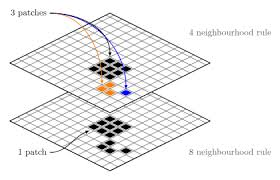

# Title slide check
이 슬라이드는 YAML의 title/author/date를 기반으로 생성되는 타이틀 슬라이드 스타일을 점검합니다.

# Title and Content
- Level 1 bullet (기본 불릿)
  - Level 2 bullet (2단계)
    - Level 3 bullet (3단계)
- **Bold**, *Italic*, `Inline code`, and a [link](https://example.com)

## Paragraph + quote
일반 문단 줄바꿈/행간/자간/한글 폰트 대체를 점검합니다. 한글/영문 혼용: 한글 ABC 123.

> 블록 인용(quote) 스타일을 점검합니다.

# Two-column layout test (Pandoc columns)
:::::: columns
::: column
### Left column
- 왼쪽 컬럼
- Bullet spacing
- 긴 문장 테스트: Lorem ipsum dolor sit amet, consectetur adipiscing elit, sed do eiusmod tempor incididunt.
:::
::: column
### Right column
1. 번호 목록
2. Numbered list
3. 3rd item
:::
::::::

# Table
| Col A | Col B | Col C |
|------:|:------|:------|
| 1     | alpha | 3.14   |
| 2000  | beta  | 2.71   |
| 30    | gamma | 1.62   |

# Code block
```python
def f(x: int) -> int:
    """Double x."""
    return x * 2
````

# Image + caption



# Speaker notes test

::: notes

* 이 슬라이드의 speaker notes 렌더링/유지 여부 점검
* Pandoc → PPTX 변환 시 notes가 남는지 확인
:::

---

# Blank slide (manual break)

 

# Small text / footnote-ish

* 작은 텍스트 테스트(수동으로 글자 크기 낮춘 레이아웃이 있다면 여기서 적용 확인)
* 각주 성격 문장: (참고) 이 줄은 보조 설명용.

# End

감사합니다.